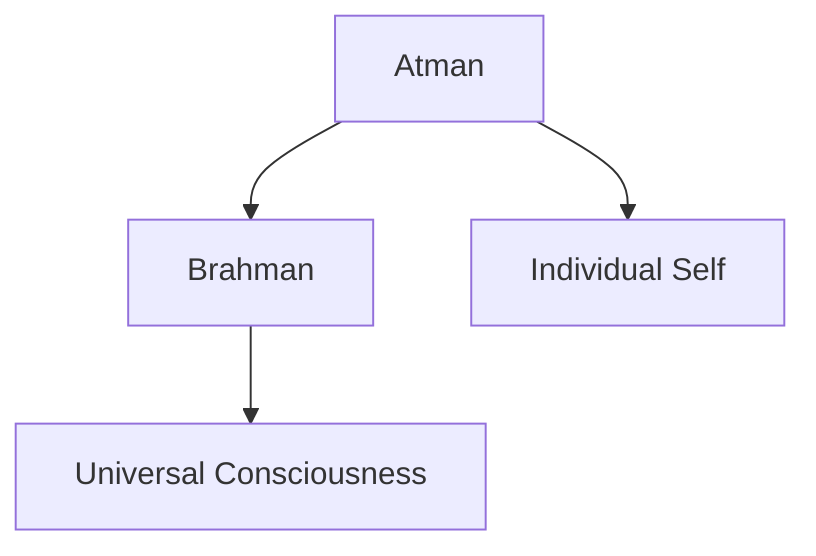
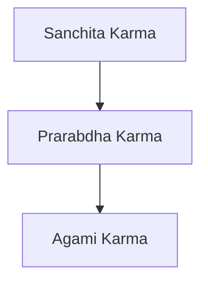

# Advaita Vedanta — In more of a Conversation 
## From Body to Brahman
### Inspired by Drig Drishya Viveka and Traditional Advaita Vedanta

---

# SECTION 1 — DRIG DRISHYA VIVEKA
## The Seer and the Seen

Vedanta ek simple observation se start karta hai:

```text
Har experience mein do cheezein hoti hain:

1. Drig   = Seer / Observer
2. Drishya = Seen / Observed
```

---

## Observation Ladder

```text
┌────────────────────┐
│ OBJECTS            │
│ Phone • Chair • etc│
└─────────┬──────────┘
          │ observed by
          ▼
┌────────────────────┐
│ SENSES             │
│ Eyes • Ears • etc  │
└─────────┬──────────┘
          │ known by
          ▼
┌────────────────────┐
│ MIND               │
│ Thoughts • Emotions│
└─────────┬──────────┘
          │ observed by
          ▼
┌────────────────────┐
│ THOUGHTS           │
│ “I am sad” etc     │
└─────────┬──────────┘
          │ witnessed by
          ▼
┌────────────────────┐
│ WITNESS / SAKSHI   │
│ Pure Awareness     │
│ Never Observed     │
└────────────────────┘
```

---

## Step-by-Step Understanding

### Step 1 — Objects

Sab external cheezein objects hain:

- phone
- chair
- body
- sounds
- emotions

Kyuki ye observe ki ja sakti hain.

### Rule:

> Jo observe ho sakta hai, wo observer nahi ho sakta.

---

### Step 2 — Senses

Phone ko kaun dekh raha hai?

```text
Eyes
```

But eyes bhi observed ho sakti hain:

- tired eyes
- blurry vision
- dry eyes

Toh eyes bhi final observer nahi hain.

---

### Step 3 — Mind

Mind interpret karta hai:

- ye red color hai
- ye acha hai
- ye boring hai

Lekin thoughts bhi observed hote hain:

- “Main sad hoon”
- “Main anxious hoon”

Toh thoughts bhi objects hain.

---

### Step 4 — Sakshi (Witness)

Ab question:

```text
Mind ko kaun observe kar raha hai?
```

Answer:

# Sakshi

Wo silent awareness jo:
- body ko dekhta hai
- thoughts ko dekhta hai
- emotions ko dekhta hai
- waking ko dekhta hai
- dreams ko dekhta hai

But khud kabhi object nahi banta.

---

# Drig Drishya Viveka Sloka

> रूपं दृश्यकं लोचनं दृक्  
> तद्दृश्यं दृक्तु मानसम् ।  
> दृश्या धीवृत्तयः साक्षी  
> दृगेव न तु दृश्यते ॥

---

## Transliteration

```text
Rupam drishyam lochanam drik
Tad drishyam drik tu manasam
Drishya dhi-vrittayah sakshi
Drig eva na tu drishyate
```

---

## Meaning

- Forms are seen by eyes
- Eyes are known by mind
- Thoughts are known by witness
- Witness itself can never be seen

---

# SECTION 2 — WHO AM I?

Vedanta bolta hai:

Tum:
- body nahi ho
- thoughts nahi ho
- emotions nahi ho
- ego nahi ho

Tum wo awareness ho jisme ye sab appear ho raha hai.

---

##  Sky and Clouds Analogy

```text
Sky     = Awareness
Clouds  = Thoughts
```

Clouds change hote rehte hain.

Sky unchanged rehta hai.

Similarly:
- thoughts change
- emotions change
- personality change

But awareness constant rehti hai.

---

# SECTION 3 — ATMAN

Ye witnessing awareness hi:

# Atman

Atman means:
```text
True Self
```

Not:
- personality
- memory
- ego
- thoughts

---

# SECTION 4 — BRAHMAN

Vedanta ka next step:

```text
Kya consciousness sirf individual hai?
```

Vedanta bolta hai:

```text
No.
```

Universal consciousness hi Brahman hai.

---

## Electricity and Bulb Analogy

```text
Electricity = Brahman
Bulbs       = Bodies
Light       = Individual experience
```

Bulbs alag hain.

Current ek hi hai.

---

## Advaita Core



---

# Mahavakyas

## Aham Brahmasmi

```text
“I am Brahman.”
```

## Tat Tvam Asi

```text
“You are That.”
```

## Prajnanam Brahma

```text
“Consciousness is Brahman.”
```

---

# SECTION 5 — MAYA

Question:

```text
Agar sab Brahman hai,
toh separation kyun dikh raha hai?
```

Answer:

# Maya

---

## Rope-Snake Analogy

Darkness mein rope ko snake samajh liya.

Snake experience hua:
- fear
- panic
- anxiety

But actual mein snake tha hi nahi.

Similarly:
Hum apne aap ko separate individual samajhte hain.

---

# Maya ki 2 Powers

---

## 1. Avarana Shakti
### Concealing Power

Truth ko hide karti hai.

Result:

```text
“I am body.”
“I am limited.”
```

---

## 2. Vikshepa Shakti
### Projection Power

False identity project karti hai.

- ego
- attachment
- jealousy
- suffering

---

## Movie Screen Analogy

```text
Screen = Brahman
Movie  = World
```

Screen bhool gaye:
```text
Avarana
```

Movie ko real maan liya:
```text
Vikshepa
```

---

#  SECTION 6 — MAYA & BRAHMAN RELATIONSHIP

Question:

```text
Kya Maya Brahman se separate hai?
```

Vedanta:

```text
Na completely separate
Na completely same
```

---

## Snake and Venom Analogy

```text
Snake = Brahman
Venom = Maya
```

Venom snake ka power hai.

Independent object nahi.

Similarly:
Maya Brahman ki power hai.

---

# SECTION 7 — THREE LEVELS OF REALITY

---

## 1. Paramarthika Satya
### Absolute Reality

```text
Only Brahman
```

---

## 2. Vyavaharika Satya
### Practical Reality

Daily life:
- body
- society
- karma
- world

---

## 3. Pratibhasika Satya
### Illusory Reality

- dream
- hallucination
- rope-snake illusion

---

## Reality Structure

# Three Levels of Reality

```text
┌──────────────────────────────────────┐
│ PARAMARTHIKA SATYA                  │
│ Absolute Reality                    │
│ Brahman Alone                       │
└──────────────────┬───────────────────┘
                   │
                   ▼
┌──────────────────────────────────────┐
│ VYAVAHARIKA SATYA                   │
│ Practical / Transactional Reality   │
│ World • Body • Karma • Society      │
└──────────────────┬───────────────────┘
                   │
                   ▼
┌──────────────────────────────────────┐
│ PRATIBHASIKA SATYA                  │
│ Illusory / Apparent Reality         │
│ Dream • Hallucination • Rope-Snake  │
└──────────────────────────────────────┘
```

---

# SECTION 8 — THREE BODIES

Vedanta bolta hai:
Human being ke 3 bodies hain.

---

## Three Bodies Map

## Three Bodies Structure

```text
┌──────────────────────────────┐
│ KARANA SHARIRA              │
│ (Causal Body)               │
│ Root Ignorance / Seed State │
└──────────────┬───────────────┘
               │
               ▼
┌──────────────────────────────┐
│ SUKSHMA SHARIRA             │
│ (Subtle Body)               │
│ Mind • Ego • Intellect      │
│ Emotions • Prana • Senses   │
└──────────────┬───────────────┘
               │
               ▼
┌──────────────────────────────┐
│ STHULA SHARIRA              │
│ (Gross Body)                │
│ Physical Body               │
│ Flesh • Bones • Organs      │
└──────────────────────────────┘
```
---

## 1. Sthula Sharira
### Gross Body

Physical body:
- flesh
- bones
- organs

Works in waking state.

---

## 2. Sukshma Sharira
### Subtle Body

Includes:
- mind
- ego
- intellect
- emotions
- prana

Dreams isi level par hote hain.

---

## 3. Karana Sharira
### Causal Body

Root ignorance.

```text
“I do not know my true nature.”
```

---

# SECTION 9 — THREE STATES

---

## 1. Jagrat
### Waking State

Physical world experience.

---

## 2. Swapna
### Dream State

Mind-created world.

---

## 3. Sushupti
### Deep Sleep

No:
- ego
- world
- thoughts

But awareness remains.

---

# SECTION 10 — TURIYA

Beyond:
- waking
- dream
- deep sleep

---

## Mandukya Upanishad Structure

## Four States Structure

```text
                 ┌─────────────────────┐
                 │      TURIYA         │
                 │ Witness Consciousness│
                 │ Pure Awareness      │
                 └─────────▲───────────┘
                           │
        ┌──────────────────┼──────────────────┐
        │                  │                  │
        │                  │                  │
        │                  │                  │
┌───────────────┐ ┌───────────────┐ ┌────────────────┐
│ JAGRAT        │ │ SWAPNA        │ │ SUSHUPTI       │
│ Waking State  │ │ Dream State   │ │ Deep Sleep     │
│ Physical World│ │ Mental World  │ │ No Objects     │
└───────────────┘ └───────────────┘ └────────────────┘
```
Its like we are living in a dream 
---

# SECTION 11 — REFLECTED CONSCIOUSNESS

This is one of the most important concepts.

---

# First: What is Ego?

Vedanta mein ego arrogance nahi hota.

Ego means:

```text
“I am this individual person.”
```

Examples:
- “I am sad”
- “I am successful”
- “I am weak”

This identity feeling is:
# Ahamkara

---

# Pure vs Reflected Consciousness

```text
1. Pure Consciousness
2. Reflected Consciousness
```

---

## 1. Pure Consciousness

This is:
- Brahman
- Atman
- Sakshi

It:
- never changes
- never suffers
- never dies

---

## 2. Reflected Consciousness

When consciousness reflects in mind,
individual awareness appears.

This reflected awareness is:
# Chidabhasa

---

# Mirror Analogy

```text
Original Face = Pure Consciousness
Mirror        = Mind
Reflection    = Ego / Individual Self
```

Reflection independent nahi hota.

Depends on:
- original face
- mirror

Similarly:
Ego depends on:
- consciousness
- mind

---

# Sun and Moon Analogy

```text
Sun       = Pure Consciousness
Moon      = Mind
Moonlight = Reflected Consciousness
```

Moon ki apni light nahi hoti.

Borrowed light hoti hai.

Similarly:
Mind borrowed consciousness se alive lagta hai.

---

# SECTION 12 — OCEAN, WAVE, FOAM

```text
Ocean = Brahman
Wave  = Individual
Foam  = Thoughts/Ego
```

Wave separate lagti hai.

Actually water hi hai.

Vedanta bolta hai:

```text
Tum wave nahi.
Tum water ho.
```

---

# SECTION 13 — KARMA

---

## Karma Structure



---

## 1. Sanchita Karma

Stored karma from many lives.

---

## 2. Prarabdha Karma

Current life karma.

Determines:
- body
- lifespan
- major experiences

---

## 3. Agami Karma

New karma created now.

---

# SECTION 14 — WHY SUFFERING EXISTS

Root problem:

# Misidentification

Hum:
- body ko “main” bol dete hain
- mind ko “main” bol dete hain
- ego ko “main” bol dete hain

Result:
- fear
- anxiety
- attachment

---

# Pot Space Analogy

```text
Space inside pot = Individual self
Infinite space   = Brahman
Pot              = Body
```

Pot toot jaye:
space merge nahi hota.

Separate tha hi nahi.

---

# SECTION 15 — MOKSHA

Moksha means:

```text
Removal of ignorance
```

Not:
- going somewhere
- becoming something new

Realization:

```text
“I was never separate from Brahman.”
```

---

# Simple Conversation Style Explanation

### ego:
“Vedanta kya bolta hai?”

### witness:
“Ki jo observe ho sakta hai wo tum nahi ho.”

---

### ego:
“Body bhi?”

### witness:
“Haan. Tum body ko observe kar sakte ho.”

---

### ego:
“Toh thoughts?”

### witness:
“Wo bhi observed hain.”

---

### ego:
“Toh real main kaun?”

### witness:
“Jo sabko observe kar raha hai — Sakshi.”

---

### ego:
“Toh Brahman?”

### witness:
“Wahi Sakshi universal level par Brahman hai.”

---

### ego:
“Toh Maya?”

### witness:
“Reality ko hide karna aur false separation project karna.”

---

### ego:
“Toh enlightenment?”

### witness:
“ego realizing it was never he never existed its all witness.”

---

# ANALOGY SUMMARY

| Analogy | Meaning |
|---|---|
| Rope-Snake | Ignorance creates illusion |
| Ocean-Wave | Individual not separate from Brahman |
| Sun-Moon | Mind reflects consciousness |
| Mirror Reflection | Ego is reflected consciousness |
| Movie Screen | Reality behind appearances |
| Electricity-Bulb | One consciousness in many bodies |
| Pot-Space | Apparent separation |

---

# FINAL ESSENCE

You are not:
- body
- mind
- thoughts
- emotions
- ego

You are:

```text
Pure Awareness
Infinite Consciousness
Brahman
```

---

# Final Reflection

Wave asks:

```text
“Where is the ocean?”
```

Ocean replies:

```text
“You were never separate from me.”
```
# Last verdict

> “You spent your whole life trying to protect the wave,
> until one day you realized:
>every thing around you is just in your mind you never seen anything nor heard or nothing 
Saant mann ne kabhi duniya nahi dekha 
> you were always the ocean.”